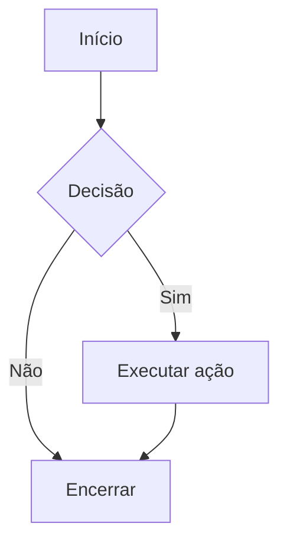
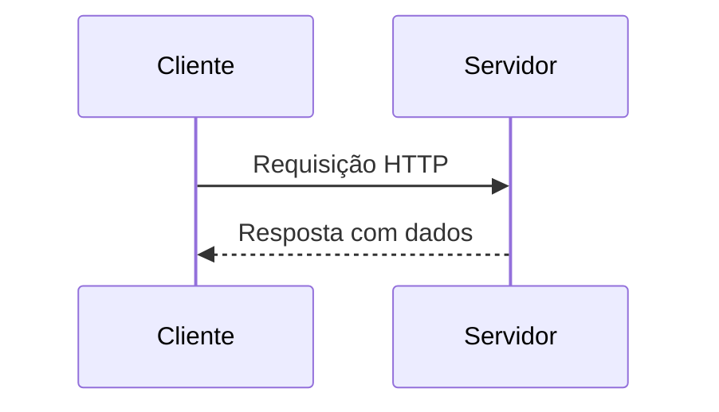
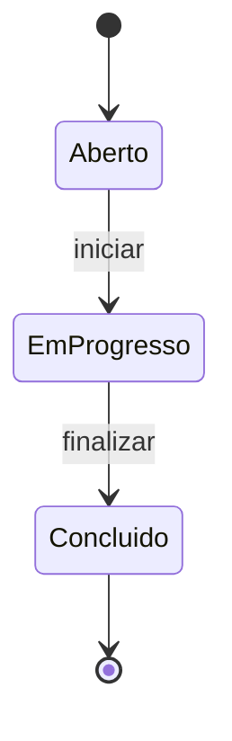
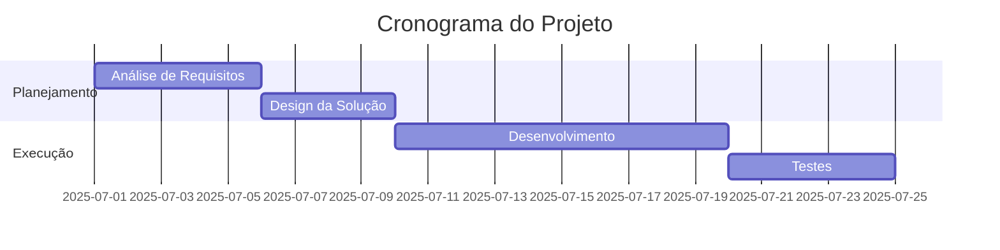
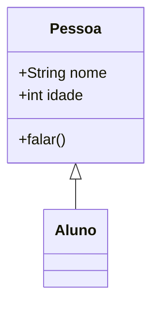
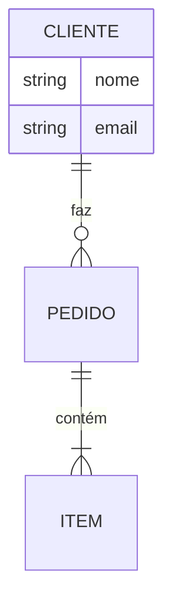
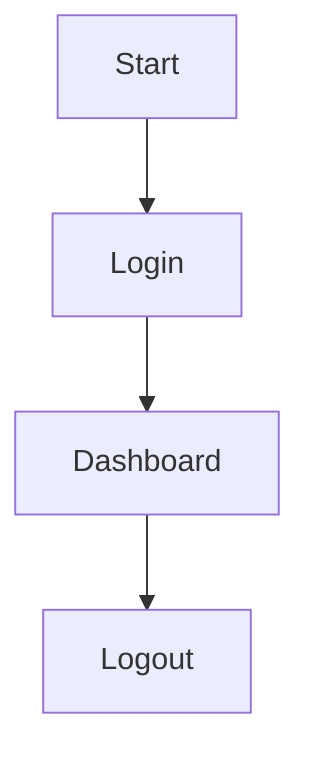
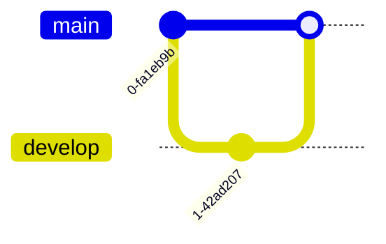
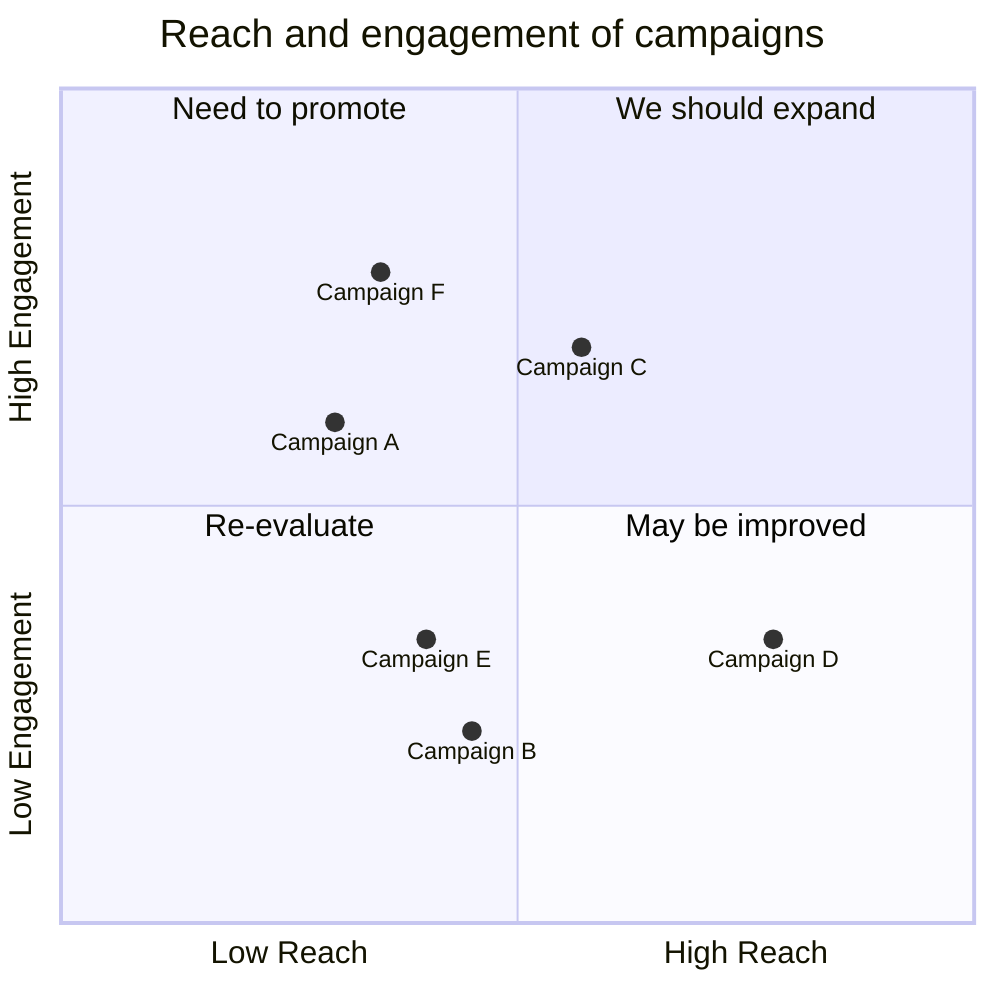

# Manual de Diagramas com Mermaid

**Objetivo**

Este manual fornece um guia completo e estruturado sobre como utilizar a linguagem [Mermaid](https://mermaid.js.org/) para criar diagramas em Markdown. Ideal para documentações técnicas, wikis e apresentações.

---
**Introdução**

**Mermaid** é uma linguagem de marcação baseada em texto que permite criar diagramas e visualizações diretamente em arquivos Markdown. É amplamente suportada por ferramentas como:

- GitHub
- GitLab
- Obsidian
- Notion (com plugins)
- MkDocs, Docusaurus, entre outras

---
**Como Usar o Mermaid Live Editor**

1. Acesse: [https://mermaid.live](https://mermaid.live)
2. Escreva o código no painel esquerdo.
3. Visualize o diagrama no painel direito.
4. Exporte como imagem (PNG/SVG) ou compartilhe via link.

---
**Como Usar no README.md**

Para fazer uso dos diagramas desenvolvidos dentro do arquivo README.md, existe algumas maneiras práticas para isso, como:
1. Exportar a imagem do diagrama e inserir no arquivo;
2. Adicionar um bloco de código mermaid no arquivo;
3. Clicar em `Copy Markdown` no Live Editor e colar no arquivo como link.

---

## Fluxograma

### O que é?

Fluxogramas representam o fluxo de processos ou decisões. São úteis para descrever:

- Algoritmos
- Processos de negócio
- Fluxos de usuário
- Lógicas condicionais

### Sintaxe Básica

### Exemplo

### Variações

- `flowchart TD` → direção **Top-Down** (de cima para baixo)
- `flowchart LR` → direção **Left to Right** (da esquerda para a direita)
- `flowchart BT` → direção **Bottom to Top**
- `flowchart RL` → direção **Right to Left**

### Simbologia

| Simbolo | Representação | Contexto |
| --- | --- | --- |
| `[]` | Bloco retangular | Processo |
| `{}` | Decisão | Condicional |
| `-->` | Seta de transição | |
| `-- Texto -->` | Seta com rótulo | |

---

## Diagrama de Sequência

### O que é?

Representa a troca de mensagens entre participantes ao longo do tempo. Ideal para:

- APIs
- Comunicação cliente-servidor
- Interações entre sistemas

### Sintaxe Básica

### Exemplo

### Simbologia

| Simbolo | Representação | 
| --- | --- | 
| `participant` | Define um ator | 
| `->>` | Mensagem síncrona | 
| `-->>` | Mensagem assíncrona | 
| `+` | Abre uma caixa de processo (request) | |
| `-` | Fecha uma caixa de processo (response) | |
| `Note right of` | Adiciona anotações | 

---

## Diagrama de Estado

### O que é?

Representa os estados possíveis de um sistema e suas transições. Útil para:

- Máquinas de estado
- Ciclos de vida de objetos
- Fluxos de interface

### Sintaxe 

### Exemplo

### Simbologia

| Simbolo | Representação 
| --- | --- |
| `[*]` | Estado inicial ou final | 
| `-->` | Transição | 
| `: evento` | Evento que dispara a transição | 

---

## Diagrama de Gantt

### O que é?

Representa cronogramas de projetos com tarefas, datas e dependências.

### Sintaxe Básica

### Exemplo

### Simbologia

| Símbolo         | Representação             |
|-----------------|---------------------------|
| `section`       | Agrupamento de tarefas    |
| `:id, data, duração` | Define tarefa         |
| `after id`      | Define dependência        |

---

## Diagrama de Classes

### O que é?

Representa a estrutura de classes em sistemas orientados a objetos.

### Sintaxe Básica

### Exemplo

### Simbologia

| Símbolo     | Representação                  |
|-------------|--------------------------------|
| `class`     | Define uma classe              |
| `+`         | Público                        |
| `-`         | Privado                        |
| `<|--`      | Herança                        |

---

## Diagrama ER (Entidade-Relacionamento)

### O que é?

Representa entidades, atributos e relacionamentos em bancos de dados.

### Sintaxe Básica

### Exemplo 

### Simbologia

| Símbolo | Representação                  |
|---------|--------------------------------|
| `||--o{` | Um para muitos                |
| `||--||` | Um para um                   |
| `o{--o{` | Muitos para muitos           |

---

## Diagrama de Fluxo de Usuário

### O que é?

Representa o caminho que um usuário percorre em um sistema.

### Sintaxe Básica

### Exemplo

### Simbologia

| Símbolo | Representação         |
|---------|-----------------------|
| `-->`   | Transição entre telas |
| `[]`    | Etapas ou ações       |

---
## Diagrama de Git

### O que é?

Visualiza branches e merges em repositórios Git.

### Sintaxe Básica

### Exemplo

### Simbologia

| Símbolo     | Representação         |
|-------------|-----------------------|
| `commit`    | Confirmação de código |
| `branch`    | Criação de branch     |
| `merge`     | Mesclagem de branches |

---

## Diagrama de Matriz

### O que é?

Representa relações cruzadas entre elementos.

### Sintaxe Básica

### Exemplo

### Simbologia

| Símbolo         | Representação         |
|-----------------|-----------------------|
| `x-axis`        | Eixo horizontal       |
| `y-axis`        | Eixo vertical         |
| `\"label\": [x, y]` | Ponto no gráfico  |

---
## Dicas de Implementação

- Certifique-se de que o arquivo tenha a extensão `.md`.
- Visualize o diagrama diretamente na interface do GitHub.
- Evite usar muitos diagramas pesados em um único arquivo para não comprometer a performance.
- Para documentação extensa, considere separar os diagramas em arquivos `.md` específicos.